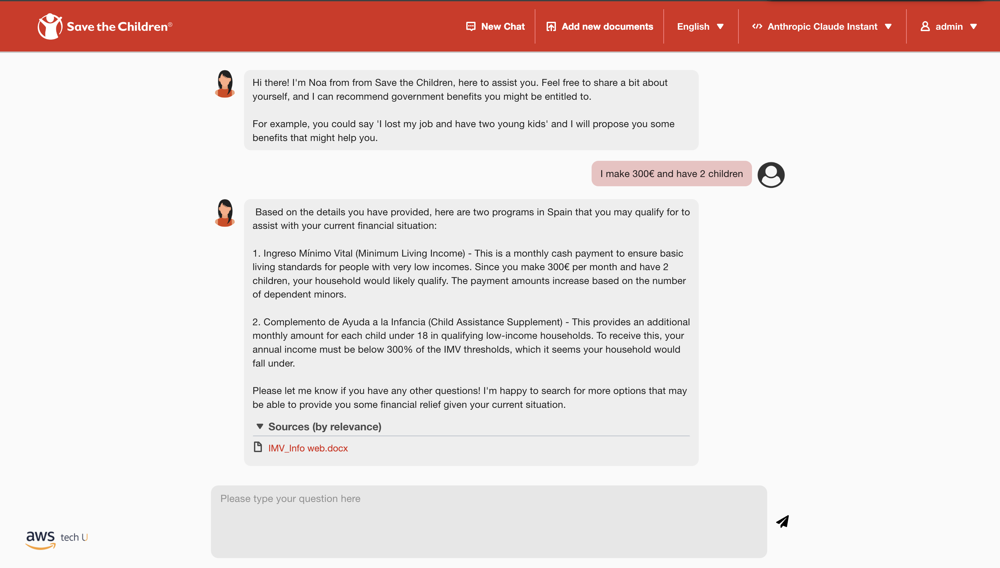
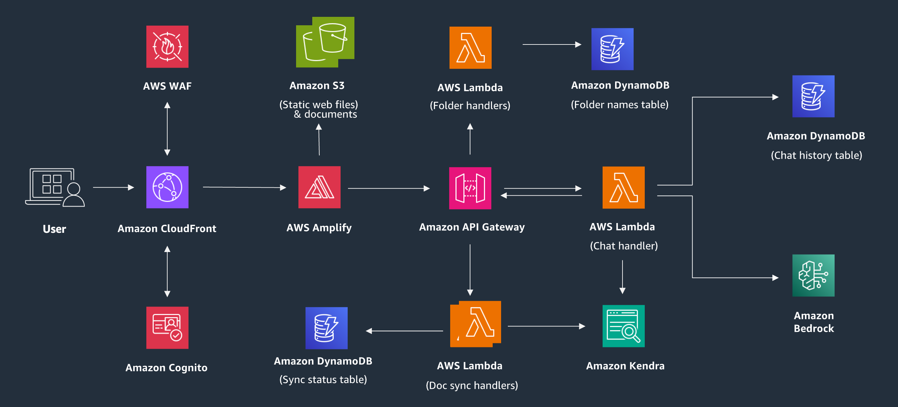

# Save the children - Non Take-UP - NoaVigate Chatbot

## Project Context
In Spain, many vulnerable families are not accessing government social benefits they are eligible for due to lack of awareness, complex application processes, and bureaucratic barriers. This issue of "non-take-up" perpetuates the cycle of poverty. NoaVigate, a conversational chatbot, was created in partnership with Save the Children to match families with suitable benefits based on their circumstances and location. The bot provides clear explanations, eligibility requirements, and step-by-step guidance for application submission. By simplifying benefit discovery and streamlining the application process, NoaVigate empowers families to access the financial support they need, mitigating hardship and promoting socioeconomic stability.


## Solution Description
NoaVigate is a web-based conversational chatbot that uses AWS cloud infrastructure and Anthropic Claude LLMs' natural language processing capabilities. It matches vulnerable families in Spain to relevant government social programs based on their provided information, such as household size, income, employment status, and location. Through a user-friendly conversational interface, NoaVigate provides clear explanations of eligibility criteria, required documents, and step-by-step guidance for submitting applications. The platform offers direct links to government portals, streamlining the entire process. Developed on AWS technology with Amazon Bedrock for security and reliability, NoaVigate aims to reduce non-take-up rates by empowering families to easily discover and apply for the benefits they qualify for, ultimately mitigating financial hardship.

### Solution Demo

*The NoaVigate Chatbot demo interface*

[<ins>Official demo video</ins>](https://broadcast.amazon.com/videos/1051381?query=aWS+Tech+U+Capstone+Event+-+EMEA&focus=title&match=AWS+Tech+U+Capstone+Event+-+EMEA+-+Introduction+%2B+Save+the+Children)

### Architecture diagram


### Stack technologies
* Front-end: React
* Back-end: AWS Amplify
* Infrastructure as Code: AWS Cloud Development Kit (CDK)

## Solution deployment
### Pre-requisites
1. NodeJs >= 16.10.0
2. Python3 >= 3.10
3. Docker
4. AWS CLI >= 2.0.0 configured with `default` profile using credentials from the corresponding AWS Account where this prototype needs to be deployed.

### Deployment steps
1. Using the AWS Management console, go to Amazon Bedrock and select **Base Models**. Select **Manage Model Access** and select the models you want access to. Request access to the Aamzon Titan and Anthropic Claude models.

2. Create a new Cloud9 environment in the **Ireland** region by following the instructions in the [AWS Cloud9 User Guide](https://docs.aws.amazon.com/cloud9/latest/user-guide/create-environment-main.html). Select **m5.large (8 GiB RAM + 2 vCPU)** as the intance type. If you do not want to use the default VPC or subnet, specify your VPC settings in the *Network Settings* section.

3. Once the Cloud9 environment is ready, clone the *merge_2* branch of this Git repository into the Cloud9 workspace.

```bash
   git clone --branch YOUR-BRANCH --single-branch https://gitlab.com/YOUR-REPOSITORY
```

4. From the root of the repo (the *Non-Take-Up* folder), run the resize.sh script to resize the Cloud9 instance to accommodate the deployment process.

```bash
   cd Non-Take-Up
   chmod +x resize.sh
   ./resize.sh 20
```

5. After the instance resize is complete, proceed with the regular deployment steps:

```bash
   cd NoaVigate_demo
   chmod +x deploy.sh
   ./deploy.sh
```

## Solution deletion
1. Navigate to the folder `NoaVigate_demo/deploy`.

2. Run the following command to delete the CloudFormation stack and all the resources created by the CDK:

```bash
cdk destroy --all
```

3. Confirm the deletion when prompted by the CDK.

4. Wait for the CloudFormation stack deletion to complete. This process may take several minutes as it needs to delete all the resources associated with the application.

5. After the stack deletion is complete, go to the Amazon S3 service in the AWS Management Console, locate the S3 buckets created for the application, and manually empty and delete them. Sometimes, the cdk destroy command may not delete the S3 buckets automatically.

6. Once the deletion is complete, you can optionally delete the local project files and the Cloud9 environment (if used) if you no longer need them.

**Note:** Deleting the application will remove all the resources, including the S3 buckets, DynamoDB tables, Lambda functions, and other services associated with the NoaVigate Chatbot application. Make sure to back up any important data or configurations before proceeding with the deletion.

## Authors

- [Nadhya Polanco](https://www.linkedin.com/in/nadhya-polanco/) - AWS Solutions Architect
- [Heidi Cantarero Lopez](https://www.linkedin.com/in/heidi-cantarero-lopez-10100b1b7/) - AWS Solutions Architect
- [Niki Sotiria Kokkalas](https://www.linkedin.com/in/niki-sotiria-kokkalas-938966208/) - AWS Solutions Architect
- [Álvaro Guerrero Gallego](https://www.linkedin.com/in/alvaroguerrerog/) - AWS Solutions Architect

## Acknowledgements

- [Jin Tan Ruan](https://www.linkedin.com/in/ztanruan) - AWSI PACE Prototyping Developer
- [Aravind Kodandaramaiah](https://www.linkedin.com/in/aravindkoda) - AWSI PACE Senior Prototyping Developer