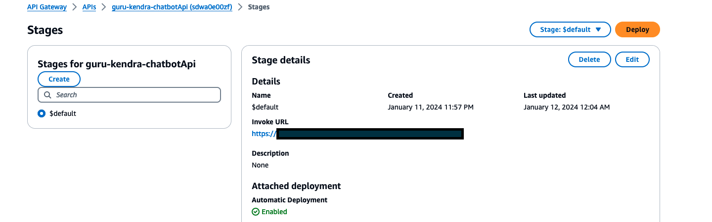

# NoaVigate Chatbot Developer Guide

This guide provides an overview of the project structure and explains how to modify and extend the functionalities of the NoaVigate Chatbot application.

## Project Structure

The project is divided into several directories and files:

- `NoaVigate_demo/api`: Contains the AWS Lambda functions for handling various APIs, including access control list, chat handler, document management, and Step Functions execution.
- `NoaVigate_demo/assets/S3_folders`: Contains sample documents organized in different folders and languages.
- `NoaVigate_demo/deploy`: Contains the AWS CDK code for deploying the infrastructure resources.
- `NoaVigate_demo/lambdas`: Contains AWS Lambda functions for managing Kendra sync jobs.
- `NoaVigate_demo/web-app`: Contains the React-based web application code for the chatbot interface.

## Modifying the Web Application

The web application is built using React and TypeScript. You can modify the application's UI and behavior by editing the files in the `NoaVigate_demo/web-app/src` directory.

1. **Install Dependencies**
   - Navigate to the `NoaVigate_demo/web-app` directory.
   - Run `npm install` to install the required dependencies.

2. **Modify the UI Components**
   - The main UI components are located in the `NoaVigate_demo/web-app/src/pages/Home` directory.
   - You can modify the JSX code in these files to change the UI layout, styling, and behavior.
     
3. **Web Application Responsiveness**
   - Media queries have been added to make the React App responsive. Breakpoints for the media queries added were: `max-width: 600px`, `min-width:601px and max-width:768px`, `min-width:768px and max-width:992px`. You can also define the font size based on different breakpoints on the media queries, changing default units of pixels for relative font size units like rem or vw.
   - To add or change the breakpoints, locate the path `NoaVigate_demo/web-app/src/App.css`. 
   - It is recommended to also improve the responsiveness posture to include CSS web layout models such as Flexbox (small-scale) or Grid (larger-scale) to create a more efficient way to display components and layouts. 

5. **Languages and UI Translation**
   - The application contains references to AWS Amplify I18n module, a lightweight internationalization solution, to translate the interface of the authentication to users.
     ```
     https://docs.amplify.aws/javascript/build-a-backend/utilities/i18n/
     ```
     ```
     https://github.com/Locale/amplify-i18n
     ```
   - AWS Amplify I18n is available as amplify-i18n package on npm.
     ```
      $ npm install amplify-i18n --save
     ```
   - The primary language of the Amplify Authentication page is set to English. You can set the default language with 'setLanguage' inside `NoaVigate_demo/web-app/src/App.tsx`, and deleting it will result in Amplify automatically detecting the browser's language on the authentication page.    
     ```
     I18n.setLanguage('en');
     ```
   - You can also create your custom dictionary and set it as your vocabularies in your app.
     ``` 
     putVocabularies()
     ```
   - To create a highly scalable and maintainable translation of the React application for users across different languages, it is recommended to first organize the translation file structure, making it easier to maintain and update translations as your project evolves. Explore storing your translations in a centralized location, such as JSON files, to make it easier to manage and update the translations. It is also necesary to integrate a language detection mechanism to automatically determine the user's preferred language based on factors like browser settings, geolocation, or user preference.
   - For mobile, it is recommended to explore other open source libraries to detect the language such as `https://react.i18next.com/` or `https://formatjs.io/docs/getting-started/installation/`.

6. **Modify the API Calls**
   - The web application communicates with the backend APIs using API Gateway URLs.
   - You can modify the API call logic in the relevant files (e.g., `NoaVigate_demo/web-app/src/pages/Home/Chat.jsx`) to change the API endpoints or request/response handling.
   - You can modify the model used by chatbot users by changing the modelID in the `function Chat()` of `NoaVigate_demo/web-app/src/pages/Home/Chat.js`. If you are adding a new model, you will also need to add the model name and corresponding ID to the `function resetModel(value)` portion of the code.
     
7. **Modify React app API Endpoint for local development**
   - If you need to change the React app API endpoint for local development, locate the `package.json` file in the `web-app` folder and search for the `"start.ex"` script. Modify the `REACT_APP_API_URL` environment variable to point to your local API endpoint or the desired endpoint.
   - For example, if the API Gateway endpoint is `https://your-api-id.execute-api.us-west-2.amazonaws.com/dev`, you can modify the `"start.ex"` script as follows:
      ```
      "start.ex": "REACT_APP_API_URL=https://your-api-id.execute-api.us-west-2.amazonaws.com/dev react-scripts start",
      ```
   - To find the API endpoint, go to Amazon API Gateway and search for `Deploy` and `Stages`
     
     

8. **Build and Deploy**
   - After making the necessary changes, run `npm run build` to build the React application.
   - The built files will be available in the `NoaVigate_demo/web-app/build` directory.
   - You can deploy the built files to a web server or update the existing CloudFront distribution with the new files by running `npm run deploy`.

## Modifying the Backend APIs

The backend APIs are implemented as AWS Lambda functions written in Python. You can modify the Lambda function code to change the API behavior or add new functionality.

1. **Modify the Lambda Functions**
   - The Lambda function code is located in the `NoaVigate_demo/api` directory.
   - Each API endpoint has a corresponding Lambda function file (e.g., `NoaVigate_demo/api/chat-handler/lambda_function.py`).
   - Modify the Python code in these files to change the API logic, integrate with external services, or add new functionality.

2. **Update the AWS CDK Deployment**
   - After modifying the Lambda function code, you need to update the AWS CDK deployment to reflect the changes.
   - Navigate to the `NoaVigate_demo/deploy` directory.
   - Modify the relevant CDK construct files (e.g., `NoaVigate_demo/deploy/src/constructs/api-python-construct.ts`) to update the Lambda function code.
   - Run `npm run build` to build the CDK app.
   - Run `cdk deploy` to deploy the updated infrastructure to AWS.
  
3. **Modify the Chatbot's Prompt**
   - The `NoaVigate_demo/api/chat-handler/prompts_factory.py` file determines which prompt is used for each Amazon Bedrock model. You can modify the prompt itself by modifying the code in the `NoaVigate_demo/api/chat-handler/prompts` folder. This folder contains 2 files - one file containing the prompt for Claude models, and one file containing the prompt for Titan models.

   - The following links contain some useful tips on how to optimize a prompt:
    https://www.promptingguide.ai/
    https://docs.anthropic.com/claude/docs/prompt-engineering (for Claude models)
    
4. **Change the LLM Model for the Final User**
   - The project currently leverages Anthropic Claude Instant as the LLM model for the final user. 
   - To change the LLM model, update in the files `NoaVigate_demo/web-app/src/components/TopBarNavigation.js` and `NoaVigate_demo/web-app/src/pages/Home/Chat.jsx`, the `selectedModel` state in the `useState` hook:
   ```jsx
   const [selectedModel, setSelectedModel] = useState("Your_Initial_Model");
   ```
   Replace `"Your_Initial_Model"` with the desired model, as stated in the `NoaVigate_demo/web-app/src/pages/Home/Chat.jsx` **resetModel** function.

5. **Update the Access Control List (ACL)**
   - The project includes an ACL template that maps Cognito user groups with S3 key prefixes for controlling access to documents.
   - You can modify the ACL template by editing the `NoaVigate_demo/api/access-control-list/post/lambda_function.py` file.

6. **Modify the initial documents that are available when the app is deployed**
   - All the initial documents are in the folder `NoaVigate_demo/assets/S3_folders`, including their translations. 
   - That folder is uploaded to the `guru-kendra-chatbot-kendrainputbucket` when the app is deployed to initialize some documents and its translations.

## Extending the Functionality - Next Steps

To extend the functionality of the NoaVigate Chatbot, you can modify the existing components or add new components to the project.

1. **Automate Document Translation on S3 Upload**
   - Follow the "Advanced approach using AWS Lambda and Real-Time Translation" described in this blog post: https://aws.amazon.com/blogs/machine-learning/translating-documents-with-amazon-translate-aws-lambda-and-the-new-batch-translate-api/
   - By following this approach, whenever a new document is uploaded to the input S3 bucket, the translation process will be automatically triggered, and the translated document will be saved in the desired output S3 location without any manual intervention.

2. **Integrate a New Model**
   - To integrate with other LLM models available in Amazon Bedrock, you may need to modify the `NoaVigate_demo/api/chat-handler/llm_factory.py` and `NoaVigate_demo/api/chat-handler/prompts_factory.py` files according to the new model's API documentation in Amazon Bedrock. In order to use the new integrated models in your application, the **resetModel** function in `NoaVigate_demo/web-app/src/pages/Home/Chat.jsx` will need to be updated accordingly, along with the `NoaVigate_demo/web-app/src/components/TopBarNavigation.js` state that initialize the LLM model for the final user.
  
3. **Using Amazon Polly to Read Chatbot Answers**
   - Convert the text answer to a streamable .mp3 file
   - Implement logic that will choose which voice will read the chatbot's response (different voices are available depending on the language).
   - Play the created audio file using the Web Audio API on the front end
   - For an example of Amazon Polly's implementation, see this repository: <https://github.com/smcelhinney/tts-demo>

4. **Integrating the chatbot with Amazon Transcribe**
   - For step-by-step instructions on how to use Amazon Transcribe with pre-signed URLs, please follow the instructions here for creating a NestJS backend: <https://medium.com/@jannden/create-an-amazon-transcribe-web-app-with-aws-sockets-ac2f2e4c7004>
   - The instructions here can be used to modify the frontend: <https://medium.com/@jannden/create-an-amazon-transcribe-web-app-with-javascript-a56c14b87db2>
  
5. **Adding Streaming Functionality**
   - Create a new [Websocket API](https://docs.aws.amazon.com/apigateway/latest/developerguide/apigateway-websocket-api.html). For *Predefined routes*, choose **Add $connect**, **Add $disconnect**, and **Add $default**. The **$connect** and **$disconnect** routes are special routes that API Gateway invokes automatically when a client connects to or disconnects from an API. API Gateway invokes the `$default` route when no other routes match a request.
   -   Update the `NoaVigate_demo/api/chat-handler/lambda_function.py` function to store and track the connection ID. 
   -   Update the fronted file `NoaVigate_demo/web-app/src/pages/Home/Chat.jsx` to push the conversation data to the newly created API

6. **Add New Features or Integrations**
   - Depending on your requirements, you can add new features or integrations to the project by modifying the existing components or adding new components.
   - For example, you can add authentication and authorization mechanisms, integrate with other AWS services or third-party APIs, or implement new document processing pipelines.
     
7. **Improving Theme Implementation with Amplify**
   - We strongly recommend transitioning to Amplify's built-in theming capabilities for a structured and scalable approach. Previously, we relied on manually overriding parameters in the CSS file to customize the theme for the demo. However, this approach is prone to conflicts as the codebase evolves. Going forward, it is crucial to implement themes using Amplify's built-in theming capabilities to provide a structured and scalable way to define and apply themes across the application. As the Amplify library evolves, adopting its built-in theming capabilities will ensure that our application remains compatible and can leverage new features and improvements.
   - Delete all manual CSS overrides of the theme inside `NoaVigate_demo/web-app/src/App.css`. Example of a manual override to be deleted:
     ```
     .awsui_link_4c84z_1gnfm_99.awsui_variant-top-navigation_4c84z_1gnfm_303:not(#\9) {
        color: white;
     }
     ```
   - Access the documentation regarding Amplify's built-in theming to learn more [here](https://ui.docs.amplify.aws/react/theming)
     
8. **Mobile App Development**
   - AWS Amplify supports a variety of frameworks and technologies, including iOS, Android, Flutter, web, and React Native. This allows the integration to Amplify's backend services, authentication, and storage features during your mobile app development.
   - Native Development: if you prioritize performance or need access to specific device features, consider native development for each platform (iOS and Android) using Swift or Kotlin.
     
9. **Using Aurora instead of Kendra**
   - In order to decrease the cost of this solution, it might be considered to replace Kendra in the applied architecture diagram by an alternative. One of the alternatives could be to replace the Kendra index, which is utilized for document search, by a vectorized database. In this scenario, the vectorized database would facilitate semantic search by leveraging advanced algorithms to understand the context and meaning of queries, similar to Kendra. This would involve creating a vector database where document embeddings could be stored and retrieved using LangChain. However, it should be noted that this transition entails a trade-off, as costs might decrease, but it introduces increased management complexity and necessitates hands-on tasks such as database provisioning, maintenance, and customization. Therefore, careful consideration of the trade-offs between cost reduction and operational overhead is imperative before implementing this change. [This example](https://community.aws/concepts/vector-embeddings-and-rag-demystified-2) contains step by step instructions on how to use Amazon Aurora, LangChain and Amazon Bedrock for Retrieval-Augmented Generation (RAG).

10. **Add New APIs**
   - Create a new directory in `NoaVigate_demo/api` for your new API.
   - Add the Lambda function code and any necessary supporting files.
   - Update the `NoaVigate_demo/deploy/src/app-stack.ts` file to include the new API in the API Gateway configuration.

Remember to follow best practices for software development, including version control, testing, and deployment automation, when modifying or extending the NoaVigate Chatbot project.
