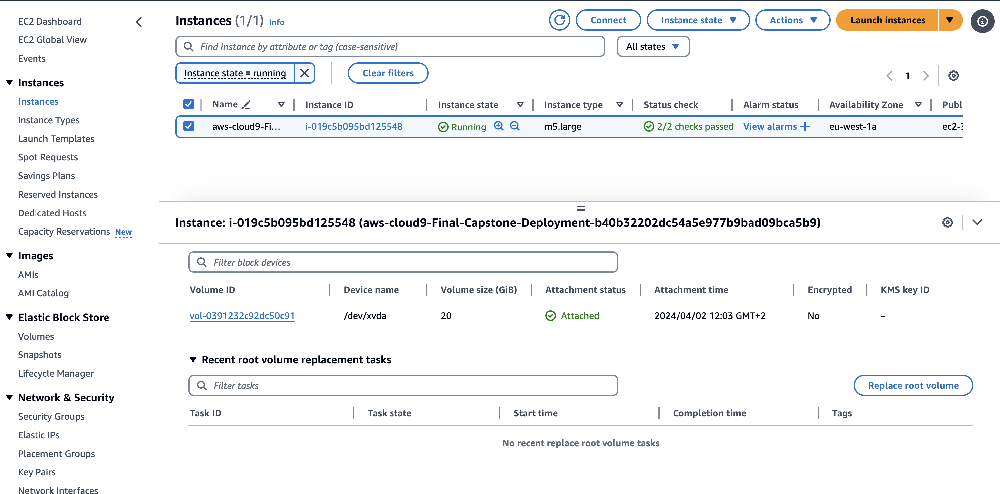

# NoaVigate Chatbot

This repository provides code samples for a Generative AI demo licensed under MIT-0 license.

NoaVigate Chatbot is a Generative AI demo that leverages Amazon Kendra and Large Language Models (LLMs) from Amazon Bedrock to create conversational experiences over enterprise content. This project combines the capabilities of Kendra for document retrieval and LLMs for natural language generation, enabling users to ask questions and receive relevant answers based on their uploaded documents. 


*The NoaVigate Chatbot demo interface*

The project supports document types such as PDF, TXT, HTML, XML, JSON, RTF, PPT and DOCX (Only text content).

This project supports the following Amazon Bedrock foundational base LLM Models.
- Anthropic - Claude V2.1
- Anthropic - Claude Instant
- Amazon Titan Express

#### ℹ️ ***Ensure Amazon Bedrock is available in the AWS Frankfurt region and that the LLM Model(s) are enabled.***


# Architecture


<br><br>


1. The application flow begins when a user accesses the website URL. Amazon CloudFront, a content delivery network (CDN), is utilized to accelerate the distribution of web content to users through caching mechanisms. 

2. AWS Web Application Firewall (WAF) is employed to enhance the security posture of the application by protecting against common web exploits and bots, with seamless integration into CloudFront for comprehensive protection and efficient performance.

3. The application implements user authentication and authorization through Amazon Cognito. Regular users and admin users are segregated, and access to different website features is controlled by implementing the principle of least privilege and enforcing separation of duties. This ensures that users only have access to the necessary resources and functionalities based on their assigned roles and permissions.

4. The website is built using the React framework and hosted on AWS Amplify, a service that facilitates the deployment and hosting of serverless web applications. 

5. When a user accesses the website URL, the static assets (HTML, CSS, JavaScript files) of the front-end application, stored in an Amazon S3 bucket, are loaded, allowing the website to be rendered in the user's browser.

6. Represents the client-server communication layer, where the Amplify client application interacts with the backend services through the API Gateway. 

7. Admin users can upload a new document through the chatbot application's interface, and select into which folder it should be uploaded. Lambda function __*guru-kendra-chatbot-listDocsInKeyPrefix*__ will be invoked by Amazon API Gateway in order to return a list of names of the existing document folders. In order to obtain this list, the corresponding DynamoDB table is queried.

8. The selected document is uploaded to the S3 bucket by connecting to the S3 API. 

9. Lambda function __*guru-kendra-chatbot-logDocumentInfo*__ stores document metadata, including the document ID, creation timestamp, and a derived key prefix, in a DynamoDB table. It expects the document ID and other relevant data in the request body and performs the necessary operations to store the metadata in the specified DynamoDB table.

10. Once a new document has been uploaded, Kendra (responsible of indexing documents) needs to be synced with the new data. The user will press the ‘Start Kendra sync job’ button through the Amazon API Gateway. 

11. Lambda function __*guru-kendra-chatbot-kendraStartDataSync*__ adds a new item to the __*guru-kendra-chatbot-SyncRunTable*__ DynamoDB table in order to track the execution details for the sync job. Lambda function __*guru-kendra-chatbot-RunOnDemandSync*__ then starts the data sync job by triggering an AWS Step Functions workflow. 

12. Lambda function __*guru-kendra-chatbot-checkJobStatus*__ will retrieve the job status (Syncing/Succeeded) from Amazon Kendra. Then, the __*guru-kendra-chatbot-updateKendraJobStatusFn*__ lambda function will update the  __*guru-kendra-chatbot-SyncRunTable*__ DynamoDB table by changing the Kendra sync job status from *Syncing* to *Succeded*, *Failed*, *Aborted*, or *Incomplete*.

13. The __*guru-kendra-chatbot-ListSyncRunsFn50D7FC14-0CxiFvyXhWga*__ function can then read the table and display the status of each sync job on the front end.
 
14. When the user asks their first question, an API call is sent via the API gateway and triggers the __*guru-kendra-chatbot-AmplifyConfigFnAmplifyConfig*__ function. This function returns information like the region, user pool ID, identity pool ID and the lambda URL endpoint for the __*guru-kendra-chatbot-chatHandlerLambda*__ function. The question is then sent to the __*guru-kendra-chatbot-chatHandlerLambda*__ function.
  
15. The __*guru-kendra-chatbot-chatHandlerLambda*__ function will first either assign a conversation ID if one was not present in the question payload (meaning this is the first question in the conversation) or it will use the conversation ID that was passed in the payload to search the __*guru-kendra-chatbot-ChatMessageHistory*__ DynamoDB table and find any questions previously asked in the current conversation. These recently asked questions will be used as a context for the user’s current question in case the user is asking a follow-up question.

16. The function will then query Amazon Kendra to find relevant documents that may contain information pertinent to answering the user’s question. Kendra will only access documents that pertain to the S3 folder the user’s Cognito group has access to.

    Based on the ACL that can be modified via the admin webapp console, certain Cognito groups have 
    access to certain S3 folders (e.g. users in the Madrid group can access the Madrid folder in 
    S3). Kendra will search the specific folder that a user’s Cognito group has permissions to 
    access in order to find and return relevant documents. There is a chance that no documents are 
    returned if Kendra cannot find any information in the documents that relate to the user’s 
    question.

17. The question, prior conversation history (if any), chosen language (based on the language the frontend is displayed in) and the relevant Kendra documents are then sent to Amazon bedrock. Given the prompt in the `claude_prompts.py` file (`titan_prompts.py` if using a Titan model), Bedrock will use the information it is provided to return an answer to the user’s question. The the Large Language Model (LLM) that Bedrock uses is determined by the Model ID that is sent in the original payload from the frontend.

    The prompt includes instructions to ignore the conversation history if the prior questions 
    asked are not related to the user’s current question.

18. After an answer is returned, the current question and answer will be added to the __*guru-kendra-chatbot-ChatMessageHistory*__ DynamoDB table in case the user continues to ask follow-up questions. This action is performed by the same function mentioned in step 15.

    When using the CDK, a random string of numbers and letters will be added to the end of __*guru- 
    kendra-chatbot-ChatMessageHistory*__ to give the table a unique name for each deployment (e.g. 
    __*guru-kendra-chatbot-ChatMessageHistoryB7EC9E35-1V5VBB1YZ249J*___ or __*guru-kendra-chatbot- 
    ChatMessageHistoryA8GHJK45-23RVHF8JLS01*__).

19. The answer will then be returned to the frontend via the connection that was opened when the original API call was sent to the lambda function URL. The frontend application will display the response to the user, effectively completing the chatbot interaction cycle.
 

---------- 

Remaining Lambda functions not visualized in the architecture:

__*guru-kendra-chatbot-BucketNotificationsHandler*__: acts as a custom resource provider for AWS CloudFormation, enabling to manage and update notification configurations for Amazon S3 buckets. It handles different scenarios based on the request type (Create, Update, or Delete) and whether the configuration is managed or unmanaged. The function interacts with the Amazon S3 service to update the notification configurations and sends a response back to CloudFormation with the operation status and details.

__*guru-kendra-chatbot-PostKendraAcl*__: stores the access control rules (permissions) for different Cognito user groups to access data in Amazon S3 buckets. The access rules are provided as a JSON object. The function saves this JSON object as a file named 'kendra_acl.json' in an Amazon S3 bucket specified by the 'KENDRA_INGESTION_BUCKET_NAME' environment variable.


__*guru-kendra-chatbot-GetKendraAcl*__: retrieves the access control list (ACL) file from the S3 bucket, containing document access rules for different Cognito user groups representing communities in Spain. It returns the ACL file content, enabling centralized management of access control rules for an Amazon Kendra index.

__*guru-kendra-chatbot-CustomCDKBucketDeployment*__: provides a flexible and configurable way to manage file deployments and synchronization between S3 buckets, with additional features like CloudFront cache invalidation, content extraction, and metadata management. It integrates with AWS CloudFormation as a custom resource provider, allowing you to declaratively manage these deployments as part of your CloudFormation stacks.

__*guru-kendra-chatbot-listKeyPrefixes*__: retrieves a list of unique key prefixes from a DynamoDB table specified by the DOCUMENTS_TABLE environment variable. It returns the list in a format suitable for rendering options or dropdown lists, where each item has a "label" and "value" key with the same value (the key prefix). In this case, this function returns the S3 folder names so admin users can specify a folder for document upload.

__*guru-kendra-chatbot-AmplifyConfigFnAuthorizerLambda*__: this function is a minimal implementation of an Amazon API Gateway Authorizer. It simply returns {"isAuthorized": True}, essentially allowing all incoming requests to be authorized without any additional checks or validations. If you would like to ensure that only certain requests are authorized (such as only users who are authorized via Cognito can send questions) this logic would need to be implemented here. 

__*guru-kendra-chatbot-ListSyncRuns*__: retrieves a list of items from a DynamoDB table specified by the SYNC_RUN_TABLE environment variable. It sorts the retrieved items in descending order based on the CreatedOn attribute and returns them as the response body. 

__*guru-kendra-chatbot-AmplifyConfigFnAmplifyConfigLa*__: retrieves various environment variables related to AWS services and configurations, such as the AWS region, Cognito User Pool ID, Cognito App Client ID, Cognito Identity Pool ID, and a function URL. It then constructs a JSON response containing these values and returns it as the HTTP response body.

__*guru-kendra-chatbot-RunOnDemandSync*__: acts as a trigger for a predefined workflow or series of tasks managed by AWS Step Functions. It starts a Kendra sync job, which triggers the Step Functions workflow to begin. The execution of that workflow provides a unique identifier (execution ARN) that can be used to monitor or interact with that specific instance of the workflow.

## Prerequisites

1. NodeJs >= 16.10.0
2. Python3 >= 3.10
3. Docker
4. AWS CLI >= 2.0.0 configured with `default` profile using credentials from the corresponding AWS Account where this prototype needs to be deployed.

## Deployment

**The deployment time ranges from 20-30 minutes.**

You can either deploy from Cloud9 for production or locally for testing.

### 1. Cloud9 deployment

1. Create a new Cloud9 environment in the **Ireland** region by following the instructions in the [AWS Cloud9 User Guide](https://docs.aws.amazon.com/cloud9/latest/user-guide/create-environment-main.html). Select **m5.large (8 GiB RAM + 2 vCPU)** as the intance type. If you do not want to use the default VPC or subnet, specify your VPC settings in the *Network Settings* section.

2. Once the Cloud9 environment is ready, clone the *merge_2* branch of this Git repository into the Cloud9 workspace.

```bash
   git clone --branch YOUR-BRANCH --single-branch https://gitlab.com/YOUR-REPOSITORY
```

3. From the root of the repo (the *Non-Take-Up* folder), run the resize.sh script to resize the Cloud9 instance to accommodate the deployment process.

```bash
   cd Non-Take-Up
   chmod +x resize.sh
   ./resize.sh 20
```

4. After the instance resize is complete, proceed with the regular deployment steps:

```bash
   cd NoaVigate_demo
   chmod +x deploy.sh
   ./deploy.sh
```

### 2. Local machine deployment for testing 

The instructions assume that this solution will be deployed from a terminal running from Linux or MacOS. The instructions should also work from a POSIX terminal running from Windows, assuming that it includes the standard GNU tools.

1. Clone this Git repository into your preferred integrated development environment (IDE) workspace, such as Visual Studio Code.

2. Ensure that you have Node.js and npm (Node Package Manager) installed on your system before proceeding with the deployment. 
   
3. Open the terminal in your IDE, and navigate to the root directory of the repository. Navigate to the `web-app` folder by running the following commands:

   ```bash
      cd NoaVigate_demo
      cd web-app
   ```
4. You can start the development server for the front-end branch by executing the following command:
   
   ```
      npm run start.ex

5. Open your web browser and navigate to `http://localhost:3000` to access the application.
   
6. Remember to change the end-point of your API inside the code if needed, for more instructions about it go to the developer guide and follow -> `Modifying the Web Application` and go to point 7: `Modify React app API Endpoint for local development`
   
7. To stop the development server, press `Ctrl + C` in the terminal where the server is running.


## Grant Model Access
1. Using the AWS Management console, go to Amazon Bedrock and select **Base Models**.

2. If you do not have access a model, you will see a message saying that you do not currently have access to the model but that you can request access in Model access. Select **Model access**.


3. Select **Manage Model Access** and select the models you want access to. Request access to the chosen models.


## Getting started

After the deployment is successful and you have ensured you have access to the required Bedrock models, follow these steps to get started on using the Chatbot:

1. Create a Cognito user - Run the following code to create a user within the Cognito UserPool. Refer to the output section of Cloudformation stack named **guru-kendra-chatbot**
   to get the value of the **CognitoUserPoolId** key. Be sure to replace the parameter values before running the commands. 

```bash
    chmod +x create-new-user.sh
    ./create-new-user.sh USER_POOL_ID USERNAME PASSWORD
```
 
2. Login into the AWS Management console, navigate to Cognito User pool. You can check the group names there and assign the user to the correct group running the commands. To be able to upload documents the user must be added to the **Admin** group.

```bash
    chmod +x add-user-to-group.sh
    ./add-user-to-group.sh USER_POOL_ID USERNAME GROUP_NAME
```

3. Login to the App. You will find the App Cloudfront URL in the output section of Cloudformation stack named **guru-kendra-chatbot**. The name of the parameter will start with **WebAppCloudFrontDistributionDomainName**.

4. Upon logging into the app, click on **Add new documents**. Click on the **Choose files** button. Choose one or more documents. Click on **Upload** to uploaded document(s) into S3. Select the option
   **Upload to existing folder**, select the folder according to the region and click **Upload**. Close the dialog after the Upload is done.

5. Role based access control - The project also provides a Access Control List template that maps Cognito user groups with S3 Key Prefixes.
   This ACL is used as a filter for search results based on the user's Group name provided by the user's JWT token forwarded by the application for the logged in user. In the following diagram, you see 3 Cognito user groups mapped to different S3 prefixes in the provided template. You are free to modify the ACL depending on your organizations security access requirements.

For more information on controlling user access to documents with tokens, refer to [documentation](https://docs.aws.amazon.com/kendra/latest/dg/create-index-access-control.html)


6. Finally, click on **Sync now** to start a Kendra Ingestion job to ingest the uploaded documents into the Kendra Index. You can monitor the Job status by clicking on the Refresh button at the bottom
   of the screen. When the Job status is **SUCCEEDED**, click on **New chat** menu option.

7. You are all set. You are now able to interact with the NoaVigate ChatBot.


## Authors

- [Nadhya Polanco - AWS Solutions Architect](https://www.linkedin.com/in/nadhya-polanco/)
- [Heidi Cantarero Lopez - AWS Solutions Architect](https://www.linkedin.com/in/heidi-cantarero-lopez-10100b1b7/)
- [Niki Sotiria Kokkalas - AWS Solutions Architect](https://www.linkedin.com/in/niki-sotiria-kokkalas-938966208/)
- [Álvaro Guerrero Gallego - AWS Solutions Architect](https://www.linkedin.com/in/alvaroguerrerog/)

## Acknowledgements

- [Jin Tan Ruan - AWSI PACE Prototyping Developer](https://www.linkedin.com/in/ztanruan)
- [Aravind Kodandaramaiah - AWSI PACE Senior Prototyping Developer](https://www.linkedin.com/in/aravindkoda)

## Troubleshoot

**Not able to connect to the Cloud9 instance**

1. Check that the associated instance is running in the EC2 console.
2. Create a new VPC with a single public subnet from the VPC console as shown [here](https://docs.aws.amazon.com/appstream2/latest/developerguide/managing-network-default-internet-access.html).
3. Delete the previous Cloud9 enviroment from the Cloud9 console and create a new one, and assign it to the created public subnet in the new VPC. The new VPC should follow [these requirements](https://docs.aws.amazon.com/cloud9/latest/user-guide/vpc-settings.html).
4. Try to connect again, and wait around 10 minutes while doing so.
5. (Optional) If the problem persist, [allocate and associate](https://docs.aws.amazon.com/vpc/latest/userguide/vpc-eips.html) an Elastic IP address to the EC2 instance associated with the Cloud9 enviroment.
6. Try to connect again, and wait around 10 minutes while doing so. Everything should be working now. 


**Cloud9 instance not resized correctly**

If you encounter issues during deployment from Cloud9, ensure that you ran the resize.sh script to resize the Cloud9 instance before proceeding with the deployment steps. If the instance is not resized correctly, the deployment may fail due to insufficient resources. You can check the size of the instance based on the *TargetSize* output in the terminal or via the Management Console.




**LLM models not enabled in the Frankfurt region**

This project requires the Amazon Bedrock LLM models to be enabled in the AWS Frankfurt region. If the models are not enabled, you may encounter errors during deployment or while using the chatbot. Double-check that the required LLM models (Anthropic - Claude V2.1, Anthropic - Claude Instant, Amazon Titan Express) are enabled in the Frankfurt region before proceeding.

**No Kendra sync performed before testing**

If you encounter issues with the chatbot not returning relevant responses, ensure that you have performed a Kendra sync after uploading your documents. The Kendra sync process ingests the uploaded documents into the Kendra index, enabling the chatbot to search and retrieve relevant information. If no sync has been performed, the chatbot will not have access to the document content.

## Updating the Application from the Cloud9 Enviroment

1.  Go to the main folder in the console: `cd NonNon-Take-Up/NoaVigate_demo`
2.  Run this commands: `npm run build && npm run deploy`
This way all the changes made to the code will be deployed to production.

## Deleting the Application from Cloud9

To delete the application and all the associated resources deployed using the AWS CDK, follow these steps:

1. Navigate to the folder `NoaVigate_demo/deploy`.

2. Run the following command to delete the CloudFormation stack and all the resources created by the CDK:

```bash
cdk destroy --all
```

3. Confirm the deletion when prompted by the CDK.

4. Wait for the CloudFormation stack deletion to complete. This process may take several minutes as it needs to delete all the resources associated with the application.

5. After the stack deletion is complete, go to the Amazon S3 service in the AWS Management Console, locate the S3 buckets created for the application, and manually empty and delete them. Sometimes, the cdk destroy command may not delete the S3 buckets automatically.

6. Once the deletion is complete, you can optionally delete the local project files and the Cloud9 environment (if used) if you no longer need them.

**Note:** Deleting the application will remove all the resources, including the S3 buckets, DynamoDB tables, Lambda functions, and other services associated with the NoaVigate Chatbot application. Make sure to back up any important data or configurations before proceeding with the deletion.

## License

This library is licensed under the MIT-0 License. See the [License](LICENSE) file.
